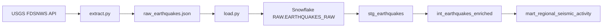
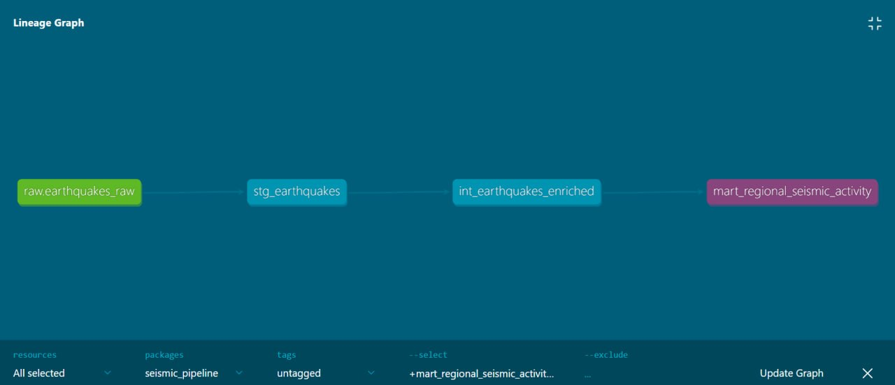

# Seismic Risk Pipeline

An end-to-end ELT pipeline (Python → Snowflake → dbt) processing 10 years of global M4.5+ seismic event data from USGS, with staging/intermediate/mart layering, automated data quality tests, and generated documentation.

## The question

Which regions of the world see the highest frequency and severity of seismic activity, and how has that activity trended year over year across the past decade?

## Architecture

## How to run it

1. `pip install -r requirements.txt`
2. Copy `.env.example` to `.env` and fill in your Snowflake credentials
3. `python extract.py` — pulls 10 years of M4.5+ events from USGS, paginated by year
4. `python load.py` — flattens the GeoJSON, stages it, and loads it into `RAW.EARTHQUAKES_RAW` via `COPY INTO`
5. `dbt run` — builds the staging/intermediate/mart layers
6. `dbt test` — runs all 6 data quality tests
7. `dbt docs generate && dbt docs serve` — view the lineage graph and full documentation

## Data quality tests

- `not_null` / `unique` on `earthquake_id`
- `accepted_values` on magnitude `band`
- Custom test asserting magnitude falls between 0 and 10

## Known limitations

- US domestic events are labeled with 2-letter state codes (e.g. `OR`) in `region` rather than a country name, unlike international entries, which fragments US seismicity across more buckets than other countries.
- Open-ocean zones (ridges, seas) and some named historical events have no comma-delimited place string, so the full `place` value is used as `region` directly — expected behavior, not a parsing gap.

## Result

*Top regions by event count, from `mart_regional_seismic_activity`:*

| region | year | event_count | avg_magnitude |
|---|---|---|---|
| South Sandwich Islands region | 2021 | 1094 | 4.82 |
| Indonesia | 2019 | 1023 | 4.82 |
| Indonesia | 2018 | 831 | 4.82 |
| Philippines | 2023 | 793 | 4.79 |
| Indonesia | 2022 | 772 | 4.78 |
| Indonesia | 2023 | 756 | 4.80 |
| Indonesia | 2021 | 720 | 4.79 |
| Indonesia | 2015 | 710 | 4.79 |
| Kermadec Islands region | 2021 | 659 | 4.85 |
| Papua New Guinea | 2018 | 647 | 4.86 |
