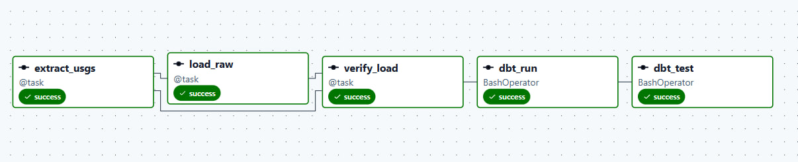

# Seismic Risk Pipeline — Airflow Orchestration

Daily orchestration of the USGS earthquake pipeline (extract → Snowflake → dbt) using Apache Airflow 3, running locally via Docker Compose.

This built on an existing standalone pipeline (`extract.py`, `load.py`, a 3-layer dbt project) by wrapping it in Airflow for scheduling, retries, idempotent reruns, and automated data-quality gates.

## Pipeline

```
extract_usgs → load_raw → verify_load → dbt_run → dbt_test
```



| Task | What it does | Idempotency mechanism |
|---|---|---|
| `extract_usgs` | Pulls M4.5+ earthquakes for the run's data interval from the USGS FDSN API. Retries with exponential backoff on 429/5xx; hard timeout; asserts result count is below USGS's 20,000-event cap (guards against silent truncation). Writes raw JSON to a date-partitioned file. | Overwrites the same dated filename on rerun — same output every time for the same interval. |
| `load_raw` | Flattens each event, stages via `PUT`/`COPY INTO` a temp table, then `MERGE`s into `RAW.EARTHQUAKES_RAW` keyed on `ID`. | `MERGE`: unmatched rows insert, matched-and-changed rows update, matched-and-unchanged rows are untouched (0 affected rows is a *correct*, not a broken, result). |
| `verify_load` | Reads the same extracted JSON, checks every extracted `ID` actually exists in `RAW.EARTHQUAKES_RAW`. Raises with the specific missing IDs on mismatch — acts as a quality gate before dbt runs on the data. | Read-only; safe to rerun any number of times. |
| `dbt_run` / `dbt_test` | Builds the staging/intermediate/mart models as views and runs all dbt tests. A failing test fails the DAG run. | Models are `view`-materialized, so they always reflect current table state — no incremental state to manage. |

Every task has `retries=3` (10s delay) and a shared `on_failure_callback` that logs which task failed, with the underlying exception, wherever that task's own log lives.

## Running it

1. **Requirements:** Docker Desktop (4GB+ memory allocated, 8GB comfortable), a Snowflake account with `RAW.EARTHQUAKES_RAW` already created (from the standalone `load.py` run) and the dbt project's `SEISMIC` database available.

2. **Clone and enter the folder:**
   ```
   git clone https://github.com/LightArtz/seismic-risk-pipeline.git
   cd seismic-risk-pipeline/airflow
   ```

3. **Create `airflow/.env`** (gitignored — real per-machine values):
   ```
   AIRFLOW_UID=50000
   SNOWFLAKE_ACCOUNT=<account_identifier>
   SNOWFLAKE_USER=<username>
   SNOWFLAKE_PASSWORD=<password>
   SNOWFLAKE_ROLE=<role>
   SNOWFLAKE_DATABASE=SEISMIC
   SNOWFLAKE_WAREHOUSE=<warehouse>
   ```
   (On Windows, `AIRFLOW_UID=50000` is fine as-is; on Linux, use your real `id -u`.)

4. **Create the `data/` folder** (gitignored, holds extracted JSON):
   ```
   mkdir data
   ```

5. **Start everything:**
   ```
   docker compose up airflow-init
   docker compose up
   ```
   First boot is slow — `_PIP_ADDITIONAL_REQUIREMENTS` reinstalls `dbt-core`, `dbt-snowflake`, and `pytest` fresh into the containers on every start (this is the Docker quick-start's own documented "for testing only" behavior, not a production pattern).

6. **Log in** at `localhost:8080` — `airflow` / `airflow` (seeded by `docker-compose.yaml` itself, not stored data — a fresh Postgres volume still gets this login).

7. **Add the Snowflake Connection** (this lives in Airflow's own Postgres, does *not* transfer via Git — must be re-added on every fresh environment):
   - Admin → Connections → **+**
   - Connection Id: `snowflake-seismic_pipeline` (must match this exact string — it's hardcoded in `seismic_pipeline.py`)
   - Connection Type: `Snowflake`
   - Fill in login/password/account/warehouse/database/role.

8. **Confirm dbt can connect:**
   ```
   docker compose exec airflow-worker dbt debug --project-dir /opt/airflow/dbt_project
   ```

9. Unpause `seismic_pipeline` in the UI. It runs daily at UTC midnight, or trigger manually any time.

## Testing

```
docker compose exec airflow-worker python3 -m pytest /opt/airflow/tests -v
```

- `test_dag_integrity.py` — confirms the DAG file imports with no errors (`DagBag().import_errors == {}`) and every task has `retries` set. Catches the exact class of mistake that otherwise only surfaces as a red banner in the UI 30 seconds after saving.
- `test_parsing.py` — unit test for `parse_feature`, the function that maps a raw USGS GeoJSON feature to a flat row. Guards against silently swapping `longitude`/`latitude`/`depth_km` (they come from a positional `coordinates` array with no field names to catch a mis-ordering).

## Known limitations

- **USGS's API is inclusive on both `starttime` and `endtime`.** An earthquake occurring at exactly a UTC midnight boundary can appear in *both* adjacent days' extracted JSON files. This doesn't cause duplicate rows in Snowflake — `load_raw`'s `MERGE` is keyed on `ID`, so the second occurrence just matches and no-ops or updates — but it means the two days' raw JSON files aren't perfectly disjoint sets.
- **Revisions published after a day's interval was already ingested may be missed.** USGS sometimes revises an event's magnitude/location after publication. If that revision happens after the daily pipeline has already processed that day, nothing automatically re-fetches it — the next natural way to pick it up is a manual backfill of that specific day.
- **The Airflow 3 UI's manual "Trigger with config" backfill dialog produced an incorrect result** (a single wrong day) in local testing, for reasons never fully diagnosed — suspected browser-timezone interaction with the date picker. Use the CLI instead for reliable historical backfills:
  ```
  docker compose exec airflow-worker airflow backfill create --dag-id seismic_pipeline --from-date YYYY-MM-DD --to-date YYYY-MM-DD
  ```
  Note `--to-date` is **inclusive**.
- **`dbt-core` and `dbt-snowflake` must be version-pinned to match exactly** (currently `1.12.1`/`1.12.1`). Leaving them unpinned in `_PIP_ADDITIONAL_REQUIREMENTS` let pip resolve mismatched patch versions once, which broke dbt's manifest parsing (`KeyError: 'dbt_snowflake://macros/apply_grants.sql'`).
- **`DagBag(include_examples=False)` is broken on this Airflow version** (a real, currently-open upstream regression in 3.3.0+, not a local bug). Omit the argument entirely — `DagBag()` already respects the `AIRFLOW__CORE__LOAD_EXAMPLES=false` config set in `docker-compose.yaml`.
- **A bare cron string (`schedule="@daily"`) does *not* give the classic data-interval behavior on this Airflow version by default** — Airflow 3's `create_cron_data_intervals` config defaults to `False`, so a plain string resolves to a "trigger" timetable where `data_interval_start` equals `data_interval_end`. This DAG explicitly uses `CronDataIntervalTimetable("0 0 * * *", timezone="UTC")` to avoid this.
- **This is a local dev setup, not production-grade.** Default Airflow/Postgres credentials, dependencies reinstalled on every container start, no secrets manager — fine for learning and local runs, not as-is for a real deployment.
- **Snowflake trial account constraints:** originally built against a 30-day trial with a credit ceiling; if rebuilding on a new account, all DDL lives in `load.py`/dbt models, so the schema is fully reproducible.

## Airflow vs. NiFi — when I'd reach for which

*(Based on hands-on Airflow experience from this project, plus running 4 production NiFi pipelines at work.)*

**This project is exactly the shape Airflow is built for:** a small number of discrete steps (call an API once a day, load a warehouse, run dbt), each with a clear dependency on the last, running on a schedule, needing to be provably re-runnable and backfillable for a specific historical date range. Nothing about it is continuous or streaming — it's "do this batch of work, once, for this one day," which is Airflow's whole unit of thought (the *data interval*).

- **Scheduling & backfill semantics.** Airflow's data interval and `catchup`/backfill model made "rerun exactly day X, and only day X" a first-class, one-line operation (`airflow backfill create --from-date ... --to-date ...`). NiFi doesn't have an equivalent concept baked in the same way — it's built around continuous flow and per-FlowFile provenance, not "replay this historical logical date."
- **Pipeline defined as code, not a canvas.** The DAG is a Python file, which is what made the pytest integrity/unit tests possible at all (`DagBag()` catching import errors, asserting every task has retries, testing the parsing function in isolation). NiFi flows live primarily as a visual canvas of connected processors; they can be exported/version-controlled, but testing a flow the way I tested `parse_feature` here — in isolation, with plain assertions — isn't the natural workflow.
- **Retry/idempotency at the step level.** Every task here has its own `retries`, and the actual data operations (`MERGE` keyed on `ID`, a truncation-count assert, an ID-diff verification) were things I had to design deliberately in Python. NiFi gives you backpressure and queuing between processors more or less for free, but the same kind of "did this exact batch land correctly, and can I prove it" logic isn't something the platform hands you — you'd still write it yourself, just inside a processor's script.
- **Debugging model is genuinely different.** Airflow's Grid/Graph view answers "did this discrete step succeed, and what did it log" — good for "which stage of today's run broke." NiFi's provenance UI answers "where is this specific piece of data right now, and what happened to it" — good for tracing one record through a live, continuously-moving flow.

**Where I'd reach for NiFi instead:** anything closer to real-time — a continuous feed rather than a once-a-day pull, especially if it needs per-record routing/transformation, backpressure between fast and slow systems, or built-in data provenance/lineage on individual records as they move. That's the shape of problem NiFi is actually built around, and it's a poor fit for Airflow, which orchestrates discrete batch steps rather than continuously processing a stream.

**Where I'd reach for Airflow:** anything that's fundamentally "run this defined sequence of steps on a schedule, for a specific time window, and I need to prove it's correct/idempotent/testable" — which is exactly what this project turned out to be.

## Project structure

```
seismic-risk-pipeline/
├── extract.py, load.py          # original standalone pipeline (10-year historical load)
├── models/, dbt_project.yml      # dbt project (staging/intermediate/mart)
└── airflow/
    ├── docker-compose.yaml
    ├── .env.example
    ├── dags/seismic_pipeline.py  # the DAG
    ├── tests/                    # pytest suite
    ├── dbt_profile/profiles.yml  # dbt connection config (env_var-based, no secrets)
    ├── data/                     # extracted JSON (gitignored)
    └── docs/                     # screenshots referenced in this README
```
